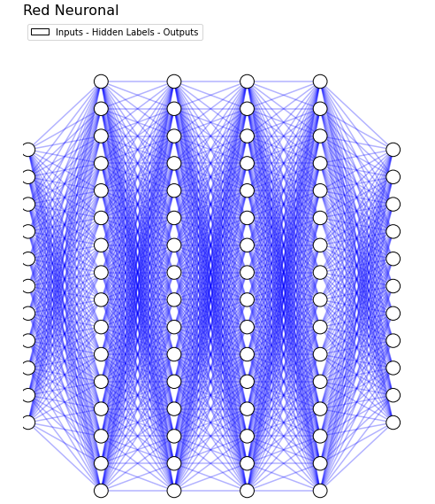
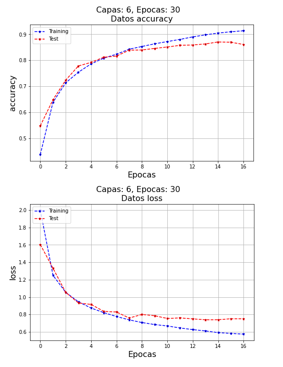

# Aprendizaje Automatico

Iniciando repositorio sobre tecnicas de machine learning.


<p>
<a href="https://www.tensorflow.org/?hl=es-419" rel="nofollow"></a>
</p>


# Librerias

<ui>

<li>
{Matplotlib}
</li>

<li>
{Seaborn}
</li>

<li>
{Scikit-Learn}
</li>

<li>
{Tensorflow}
</li>

<li>
{NLTK}
</li>

 
 # Introduccion
  
Cualquier técnica que permita que la computadora replique de alguna forma procedimientos característicos de la inteligencia humana está encuadrada dentro de lo que llamamos <b>inteligencia artificial</b>. 

<b>Machine Learning</b> es un subconjunto de metodologías de inteligencia artificial que permite a las computadoras aprender con la experiencia, estos algoritmos son capaces de identificar patrones en conjuntos masivos de datos y de realizar análisis predictivos.

Dentro del Machine Learning hay un subconjunto llamado <b>Brain-inspired</b> que se basan principalmente en modelos y métodos que se replican el mecanismo del cerebro. 

Las <b>redes neuronales</b> son modelos simplificados que emulan el modo en el que el cerebro procesa la información, funciona basado en un número elevado de unidades de procesamiento simultaneas interconectadas que son versiones artificiales de las neuronas, y se organizan en capas. 

El <b>deep learning</b> es un subconjunto de las redes neuronales, lleva a cabo un proceso de machine learning utilizando una red neuronal artificial. 

Este repositorio contiene trabajos sobre entrenamiento de modelos con redes neuronales utilizando la libreria [Tensorflow](https://www.tensorflow.org/?hl=es-419). Para los trabajos de clasificacion se utiliza la libreria [Scikit-Learn](https://scikit-learn.org/stable/). 
  
<p align="center">
  
</p>

 # Inputs

 A continuacion se muestra una parte del codigo que se utiliza para generar los inputs de las Redes Neuronales:

```python
class Model():
    def __init__(self):
        self.links = []

    def _colored(self, r, g, b, text):
        return "\033[38;2;{};{};{}m{} \033[38;2;255;255;255m".format(r, g, b, text)
      
    def _input(self):
        while True:
            modelo = input('\nDesea entrenar una Red Neuronal? (Si/No): \n')
            if modelo == 'No':
                print('Muchas gracias\n')
                break
            elif modelo == 'Si':
                print('Excelente...')
                scaler   = input('Desea escalar los valores? (Si/No)').lower()
                neuronas = int(input(f'Ingrese la cantidad de Neuronas:'))
                outputs  = int(input(f'Ingrese la cantidad de Outputs:'))
                capas    = int(input(f'Ingrese la cantidad de Capas Ocultas:'))
                epocas   = int(input(f'Ingrese la cantidad de Epocas:'))
                    
            if modelo == 'Si': break
            else:
                print(self._colored(238, 75, 43, '\nADVERTENCIA: Por favor colocar (Si/No)\n'))
        if modelo == 'Si':
            diccionario = {'capas' : capas, 'neuronas' : neuronas, 'outputs': outputs, 'scaler' : scaler, 'epocas' : epocas}
            print(self._colored(238, 75, 43,f'La cantidad de Capas es: {capas}'))
            print(self._colored(238, 75, 43,f'La cantidad de Neuronas es: {neuronas}'))
            print(self._colored(238, 75, 43,f'La cantidad de Epocas es: {epocas}'))
            return diccionario
        else:
            return None

```

 # Red Neuronal Plot

 Code:

```python

def _plot_neuronal_net(ax, left, right, bottom, top, layer_sizes):
        n_layers = len(layer_sizes)
        v_spacing = (top - bottom)/float(max(layer_sizes))
        h_spacing = (right - left)/float(len(layer_sizes) - 1)
        # Nodes
        for n, layer_size in enumerate(layer_sizes):
            layer_top = v_spacing*(layer_size - 1)/2. + (top + bottom)/2.
            for m in range(0 , layer_size + 1):
                circle = plt.Circle((n*h_spacing + left, 
                                     layer_top - m*v_spacing), 
                                    v_spacing/4.,
                                    color='w', 
                                    ec='k', 
                                    zorder=3)
                ax.legend([circle], ['Inputs - Hidden Labels - Outputs'], loc='upper left')
                ax.add_artist(circle)
        # Edges
        for n, (layer_size_a, layer_size_b) in enumerate(zip(layer_sizes[:-1], layer_sizes[1:])):
            layer_top_a = v_spacing*(layer_size_a - 1)/2. + (top + bottom)/2.
            layer_top_b = v_spacing*(layer_size_b - 1)/2. + (top + bottom)/2.
            
            for m in range(0 ,layer_size_a +1):

                for o in range(0, layer_size_b + 1):
                    line = plt.Line2D([n*h_spacing + left, (n + 1)*h_spacing + left],
                                    [layer_top_a - m*v_spacing, layer_top_b - o*v_spacing], 
                                      c='b', alpha=0.3)
                    ax.add_artist(line)

fig = plt.figure(figsize=(10, 10))
ax = fig.gca()
ax.axis('off')
_plot_neuronal_net(ax, .01, .75, .05, .9, [10, 15, 15, 15, 15, 10])
plt.title('Red Neuronal', loc = 'left', fontsize=16)

```

Img:

<p align="center">
  
</p>


 # Metrics

 
```python

def _get_plots(metricas_train, metricas_test, hyper_p, y_label = 'Metrics'):
    capas = hyper_p['capas']
    epocas = hyper_p['epocas']
    plt.figure(figsize = (8,5))
    plt.plot(
            metricas_train,
            color = 'blue', 
            linestyle = 'dashed', 
            marker = '*', 
            markerfacecolor = 'black', 
            markersize = 5,
            label = 'Training')
    plt.plot(
            metricas_test,
            color = 'red', 
            linestyle = 'dashed', 
            marker = '*', 
            markerfacecolor = 'black', 
            markersize = 5,
            label = 'Test')
    plt.title(f'Datos {y_label}', fontsize=16)
    plt.suptitle(f'Capas: {capas}, Epocas: {epocas}', fontsize=16)
    plt.xlabel('Epocas', fontsize=16); plt.ylabel(y_label, fontsize=16)
    leg = plt.legend(loc='upper left')
    return plt.grid(); plt.show()

```

Img:

<p align="center">
  
</p>
